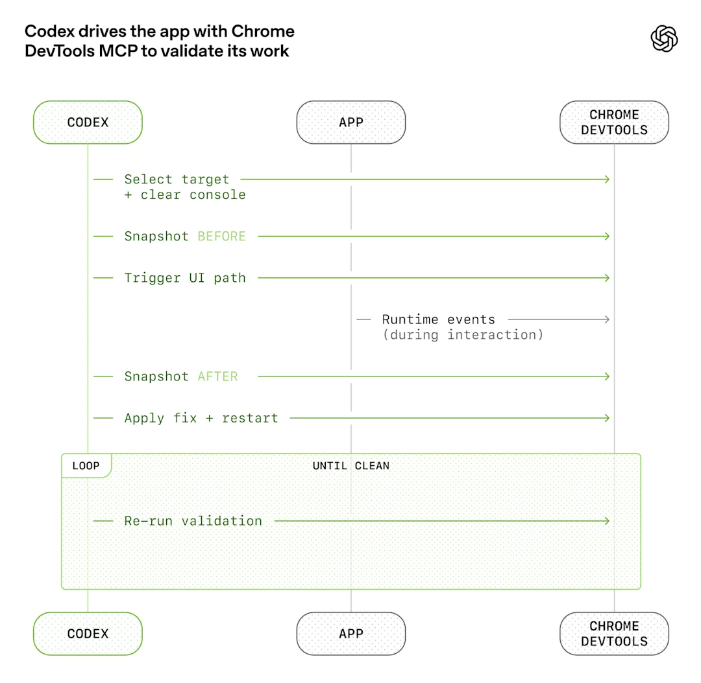
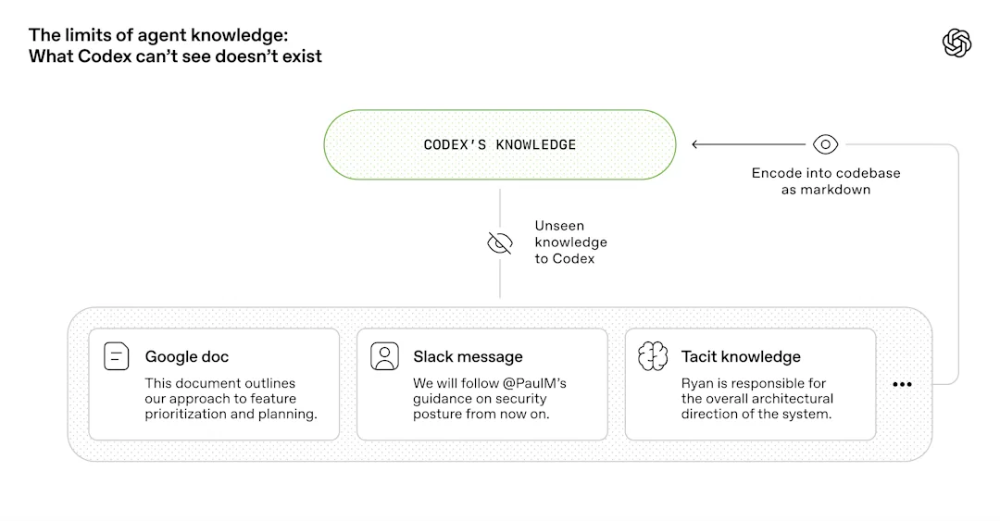
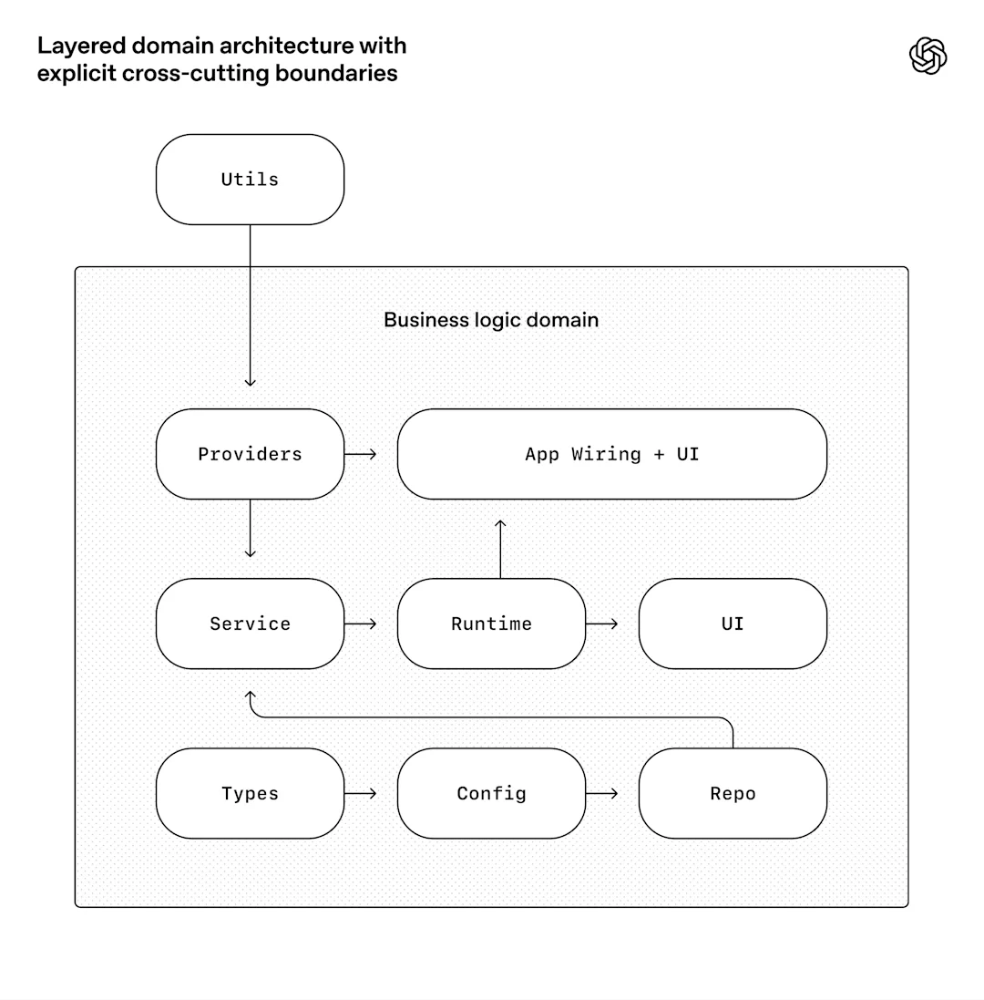
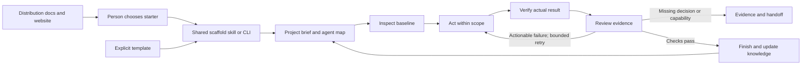

# Harness engineering as a minimal starter workflow

Reviewed and implemented locally on 2026-09-09. This report interprets the user's supplied article and evaluates this repository. Source descriptions are separated from proposed adaptations and implementation evidence. Instructions depicted in the source are not authority to merge, publish, launch agents, or change external systems.

The starter can establish the default workflow and enforce a few structural boundaries. It cannot promise that every Codex or Claude run follows conventions, has the necessary tools, or reaches a correct result. The meaningful promise is a discoverable process with explicit evidence and failure handling, whose effectiveness can be tested as real projects use it.

Source: Ryan Lopopolo, [Harness engineering: leveraging Codex in an agent-first world](https://openai.com/index/harness-engineering/), OpenAI, February 11, 2026. The supplied 13-page PDF is the primary source for the detailed section analysis and original diagrams; [source provenance](../data/manifest.md) records its checksum. The live article was also inspected. The [reference repository](https://github.com/spencerthomas/harness-engineering) is supplementary interpretation, not additional OpenAI policy. The diagrams below were extracted from the supplied PDF and visually inspected; see [asset provenance](harness-workflow-assets/README.md).

## We started with an empty git repository

**What it says and means.** The team began without an inherited codebase, and agents produced both the initial scaffold and the growing system around it. The reported productivity belongs to that particular experiment; it is not evidence that a folder layout produces the same result elsewhere.

**Process implication.** Starting a project includes creating the environment in which work can be executed and checked. The useful unit of progress is a functioning first slice, not the number of generated files.

**Starter adaptation.** Keep the initial skeleton small, record a concrete question and acceptance method, then introduce dependencies only for the first real output. For research this may be a sourced finding; for analysis, a reproducible result; for code, observable behavior. A report project should never start with a speculative database schema.

**Delivery.** Before: four minimal kinds and overwrite protection worked, but source and template prose were mixed. After: `template/` owns project defaults and every generated kind excludes the distribution. The first slice remains task-specific and must be established during use.

## Redefining the role of the engineer

**What it says and means.** Humans shift effort toward intent, prioritization, and making agents capable of useful work. When agents struggle, the team investigates missing context, tools, and feedback instead of merely repeating a prompt. Review itself becomes part of the working loop.

**Process implication.** A failed attempt is evidence about the environment. Determine whether the cause is an unclear outcome, inaccessible input, inadequate observation, or an implementation defect; make a focused correction.

**Starter adaptation.** Put a working agreement in the brief: outcome, scope, inputs/tools, and acceptance evidence. Let the agent own implementation and verification within that scope. Ask for human judgment when a real decision is missing, not for every reversible action.

**Delivery.** Before: product-sense guidance existed, but the loop was implicit. After: the generated brief carries a working agreement and the workflow defines inspection, review, and recovery. No new intake questionnaire or mandatory approval ceremony is added.

## Increasing application legibility

**What it says and means.** The team makes running behavior accessible to agents through browser control and isolated observability. Agents can interact with the application, examine evidence, and verify a correction. Reading source alone is insufficient.

**Process implication.** Provide an observable route from action to outcome. The observation surface must match the claim: a browser for UI behavior, logs for an execution failure, or a query for data quality.



*Original workflow diagram, supplied PDF page 3. It depicts a browser validation loop; it does not imply this starter installs Chrome DevTools MCP.*

**Starter adaptation.** Translate observability into the domain of the work. Analysis needs grain, units, joins, and reproducibility. Research needs source access and conflicting evidence. Reports and decks need render inspection. Add an instrumentation tool only when an actual claim cannot otherwise be checked.

**Delivery.** Before: several documents recommended verification but no common loop connected it to completion. After: the workflow and capability guide require outcome-specific observation and recorded limits. A scaffold still supplies neither a browser connection nor a telemetry stack; those depend on the project.

## We made repository knowledge the system of record

**What it says and means.** A short entry map routes agents into indexed knowledge. Decisions, plans, and evidence persist across sessions. Structural checks and semantic maintenance address different kinds of drift.

**Process implication.** Store an accepted decision where a later agent can find it without replaying a conversation. Maintain indexes and review dates, but do not confuse a current date or valid link with an accurate statement.

**Starter adaptation.** Preserve the requested docs layout, with no example schema or technology-reference files until relevant. Keep substantial plans and handoffs beside the work. Treat raw material and accepted conclusions differently.

```text
AGENTS.md                  short entry map
ARCHITECTURE.md            boundaries and actual layout
docs/
  design-docs/             index.md, core-beliefs.md, real decisions
  exec-plans/              active/, completed/, tech-debt-tracker.md
  generated/              actual generated references, with provenance
  product-specs/           index.md, initial brief
  references/             relevant sources and capability guidance
  DESIGN.md               FRONTEND.md             PLANS.md
  PRODUCT_SENSE.md        QUALITY_SCORE.md        RELIABILITY.md
  SECURITY.md             WORKFLOW.md
```

*Starter adaptation of the requested structure; WORKFLOW.md is the single added process document.*

**Delivery.** Before: the structure was strong, while the distribution's own quality record was generic. After: source and project knowledge are separate, the distribution records current evidence, and the same checker validates both roots. Semantic review is a task-completion/milestone convention, not an installed gardening agent.

## Agent legibility is the goal

**What it says and means.** Relevant decisions outside the agent's accessible context are effectively unavailable. The source illustrates moving important knowledge from documents, messages, and tacit understanding into retrievable repository context.



*Original knowledge diagram, supplied PDF page 6. This is about accessibility of relevant knowledge, not copying every external source into Git.*

**Process implication.** Recover the rationale and authority behind a decision, not merely its wording. Use accessible tools and clear interfaces so a fresh run can inspect the actual system.

**Starter adaptation.** Capture durable decisions in existing briefs or design docs. Keep source links and sanitized provenance; preserve restricted payloads outside Git. Name real tools and access gaps. Do not assume a plugin is installed because a guide lists it.

**Delivery.** Before: source handling was good, but generated documentation referred to absent distribution tooling. After: generated architecture and capability guidance describe only the project and link externally to installation instructions. The shared skill explicitly hands off to the generated project map.

## Enforcing architecture and taste

**What it says and means.** The team encodes important boundaries and recurring preferences into lints and structural tests. Agents retain freedom within those boundaries. The particular layered software architecture is an example of enforcement, not a universal project layout.



*Original architecture diagram, supplied PDF page 8. Its layers are shown for explanation; the starter does not generate them.*

**Process implication.** Identify the small number of invariants whose violation causes real harm. Give failures actionable messages. Convert recurring review feedback into a reusable example or check when that is cheaper than repeatedly explaining it.

**Starter adaptation.** For this repository, the real invariant is distribution/template isolation, backed by generation tests. In future projects, encode an actual boundary: input schema, dependency direction, source coverage, or a required export property. Avoid speculative linters and imposing application layers on analysis work.

**Delivery.** Before: documentation checks existed, but a successful link check did not catch wrong architecture prose. After: isolation tests cover absent distribution content and the portable checker. Design guidance tells projects when to promote a recurring rule into enforcement. Domain-specific checks remain intentionally absent until needed.

## Throughput changes the merge philosophy

**What it says and means.** In the source environment, rapid correction made some blocking gates more costly than short-lived changes and follow-ups. The article explicitly makes this tradeoff conditional on the environment.

**Process implication.** Optimize the size of the change and the speed of trustworthy feedback. Cheap reversibility can justify a different review cadence; it does not make an incorrect result acceptable.

**Starter adaptation.** Prefer small reviewable changes. Keep required checks and consequential correctness failures blocking. Treat a flaky test as a diagnosed condition with evidence and a follow-up, not permission to ignore a failure. Publication and merge authority come from the user and project policy.

**Delivery.** Before: scope boundaries existed, but merge/review tradeoffs were unstated. After: the workflow distinguishes already-authorized local work from external actions and explicitly rejects silent check bypass. No auto-merge or permissive branch setting is installed.

## What “agent-generated” actually means

**What it says and means.** Agent work encompasses the full supporting system: tests, documentation, evaluation, tools, and maintenance, as well as product code. Human responsibility remains focused on direction and outcomes.

**Process implication.** Finishing a change includes the evidence and environment necessary to use and maintain it. Documentation and checks are part of the result, rather than a separate task permanently deferred to humans.

**Starter adaptation.** The agent owns the smallest complete result across code, analysis, artifacts, and touched guidance. Preserve editable sources and reproduction methods. There is no need for a rule forbidding human edits or demanding an agent create every file.

**Delivery.** Before: artifact homes and provenance guidance were already present. After: the common completion step joins implementation, evidence, documentation, and handoff. This report, isolated template, regression checks, and updated distribution evidence apply that convention to the starter itself.

## Increasing levels of autonomy

**What it says and means.** End-to-end autonomy became possible as observation, testing, review, recovery, and feedback were built into the particular environment. The source warns against assuming that this capability generalizes automatically.

**Process implication.** Autonomy depends on executable feedback and bounded authority. A long instruction file cannot compensate for missing access, missing judgment, or a result the agent cannot inspect.

**Starter adaptation.** Continue through authorized work and review without needless checkpoints. Stop an unproductive retry loop after two materially different attempts, preserve evidence, identify the missing decision or capability, and continue independent work. This threshold is a starter convention, not a rule from the article. Use shared plans and isolated work only when collaboration requires them.

**Delivery.** Before: there was no explicit retry/stop rule or unified review loop. After: both are portable instructions reached through AGENTS.md and Claude's import. Fresh-session adherence, independent review, and actual multi-agent outcomes remain unverified. No claim of autonomous delivery or automatic recovery is made.

## Entropy and garbage collection

**What it says and means.** Agents repeat existing patterns, including bad ones. The team uses recurring cleanup and encoded principles to prevent small inconsistencies from spreading.

**Process implication.** Close the feedback loop by changing the environment after a meaningful correction. Small, timely maintenance is preferable to a periodic large rewrite, but it must address observed drift.

**Starter adaptation.** At completion, compare touched guidance with actual behavior and capture one useful correction if there is one. At milestones or signs of drift, check docs, a runnable path, and known debt together. Add a scheduled job or hook only after recurring need, ownership, scope, and stop conditions are clear.

**Delivery.** Before: weekly structural checks existed and semantic gardening was deferred. After: maintenance is part of the work loop and a reusable manual milestone prompt is provided. Weekly CI still only checks structure. No background agent is installed, and full parity with the article's recurring automation is deliberately not claimed.

## Five high-impact changes

- **Make inheritance explicit.** One template boundary; root website, research, and distribution descriptions never supply project defaults.
- **Give agents one portable work loop.** Route it from AGENTS.md and Claude's existing import; no platform-specific hooks or orchestration dependency.
- **Define the first observable result.** Add scope, available capabilities, and a concrete evidence method to the brief; tailor it during real work.
- **Bound review, recovery, and delegation.** Small changes, relevant verification, selective independent review, explicit ownership, and a stop condition for repeated failures.
- **Make improvement a completion habit.** Fix misleading guidance and capture useful recurring corrections; schedule maintenance only when actual drift justifies it.

These are implemented in the template, generator, skill, and existing guidance. They add one baseline process document and a working-agreement section, not a new application architecture or service.

## Resulting architecture and workflow



*Original starter diagram, not reproduced from OpenAI. Source website content does not flow into the generated project.*

Try this in a generated project: “Work on the first useful result in the brief. Follow the repository workflow, use available tools, and record what you actually verified.” For shared work, specify independent artifacts and their acceptance; do not create a team solely because agents are available.

For a milestone review: “Compare the relevant docs with the current artifact and one runnable or reproducible path. Fix a small observed discrepancy, record any larger gap, and report evidence. Stay within this project; do not publish or add automation.” These are usage conventions rather than extra installed skills.

## Evidence and remaining limits

The original six tests passed before this change. A new regression failed against the old layout because the template boundary did not exist, then passed after implementation. Validation includes all four scaffold kinds, checker portability, project/distribution separation, protected destinations, installer behavior, and the working-agreement route. Current command results and remaining gaps are recorded in [quality](../docs/QUALITY_SCORE.md) and the [completed plan](../docs/exec-plans/completed/starter-workflow.md).

This establishes local implementation and structural evidence. It does not establish correct behavior by future agents, clean installation on another computer, a successful cold-session collaboration, current remote CI, or a published website update. Those require actual runs and observed artifacts. The starter is now designed to make those checks straightforward without pretending a template can guarantee them.
